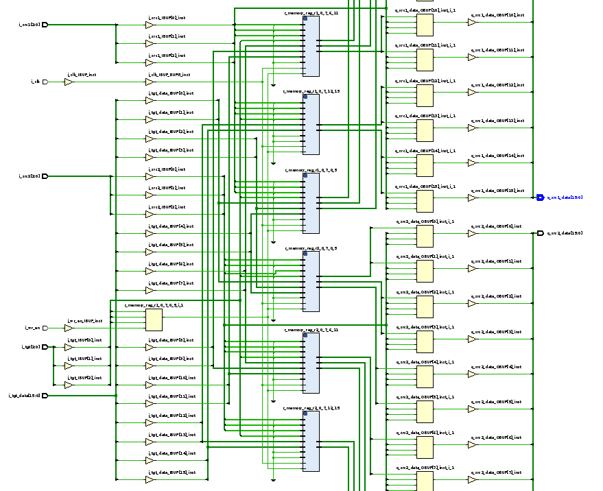
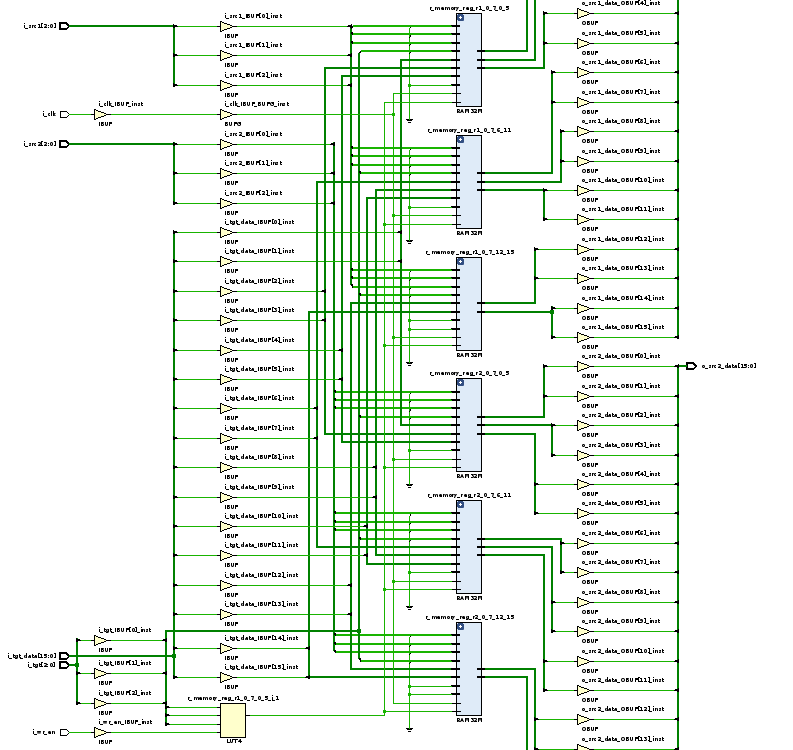
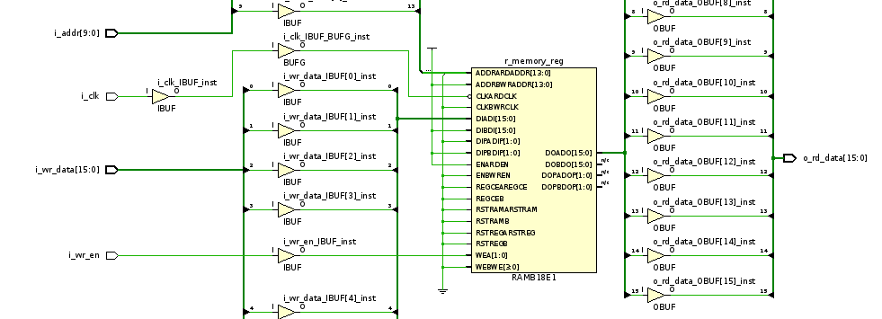

## Pipeline design

### ISA summary

| Instruction | Description | 
|---|---|
| ADD         | ```rega = regb + regc``` |
| ADDI        | ```rega = regb + imm``` |
| NAND        | ```rega = regb + regc``` |
| LUI         | ```rega = imm``` |
| SW          | ```mem[regb + imm] = rega``` |
| LW          | ```rega = mem[regb + imm]``` |
| BEQ         | ```pc = rega == regb ? pc + 1 + imm : pc + 1``` |
| JALR        | ```rega = pc + 1; pc = regb;``` |

### Fetch and stalls

Issue : all instructions write to the target only in writeback stage (last stage). But, its results may be required by the next instruction. Examples :
```
add  r1, r0, r2
nand r3, r1, r2
...
```
When the ```nand``` is in decode stage, it needs to use value in ```r1```. But, it can only get uptodate value of ```r1``` when ```add``` instruction has written it back to the regfile in the writeback stage.

This is called a **data hazard**.

But the reality is that we have result of ```r1``` as early as after the execute stage of ```add```, just not in the register file. And, we only use the value in ```r1``` when ```nand``` is in its execute stage. So, we do something called "forwarding", where the value of ```r1``` is forwarded from the ```add``` instruction when it has finished execute stage to ```r``` in ```nand``` when it starts execute stage. 

We store the results of the instruction in registers. We name them based on the preceeding stage. For example, the "execute stage output pipeline register" stores the value of exec stage ouptput on the previous cycle.

Let us tabulate where result is available, when source registers are needed and when branching is required by instructions.

| Instruction | Result stage | Source stage | Branch stage |
|---|---|---|---|
| ADD         | Execute      | Execute | Fetch |
| ADDI        | Execute      | Execute | Fetch |
| NAND        | Execute      | Execute | Fetch |
| LUI         | Decode       | Execute | Fetch |
| SW          | None         | Execute | Fetch |
| LW          | Memory       | Execute | Fetch |
| BEQ         | None         | Execute | Execute |
| JALR        | Execute      | Execute | Decode |

Result stage : Stage where result is generated for an instruction
Source stage : Stage where the source is required for an instruction
Branch stage : Stage where the branch target is known for an instruction

We can see all instructions need operands in the execute stage only! Also, all instructions generate outputs in execute stage except LW.

Ignoring LW, we can feed previous output of exec stage back to its input to forward the data. But that works only for 2 adjacent instructions. What if there was another one between them, like
```
add  r1, r0, r2
addi r4, r2, 10
nand r3, r1, r2
```
Here we need to forward from mem stage to exec stage. Similarly for
```
add  r1, r0, r2
addi r4, r2, 10
addi r5, r2, 100
nand r3, r1, r2
```
We need to forward from wb stage to exec stage.


But if we consider LW, we have a problem! If we have say,
```
lw r1, r2, 100
add r3, r1, r0
...
```
```add``` needs ```r1``` in exec stage while ```lw``` is in mem stage and only getting the result from memory! So, we add a "bubble" in the pipeline, or a ```nop``` instruction (here, an ```add r0, r0, r0```)

Another circumstance needing pipeline bubbles is branching. What instruction does the fetch stage fetch when it sees a branch or jump instruction? How can it find the target before computing it?! Well here we just wait and send nop instructions till the result is computed, i.e for ```BEQ``` after its exec stage and for ```JALR``` after its decode stage. So, we add

- 2 nops for a BEQ instruction
- 1 nop for a JALR instruction
- 1 nop for a LW instruction with suceeding instruction using its target as source

We add bubbles as follows (conditions are checked in the pipeline registers, not the outputs itself)
- Fetch stage
  - opcode is BEQ
  - opcode is JALR
- Decode stage
  - opcode is BEQ
- Execute stage
  - opcode is LW with tgt same as any src


Now let us work our way backwards from the end of the pipeline to the beginning.

### Writeback stage

To write back to regfile, we need to know if the instruction actually writes to the regfile. We could store a write enable bit, but here we can use a small trick by writing to ```r0``` every time. That way we dont need to maintain an extra bit! Another way could be to find write enable from opcode in the writeback stage.

### Memory stage

In the memory stage, we either load data from ```regb + imm``` or we store data from ```rega``` into ```regb + imm```. So, the ALU needs to calculate the value or ```regb + imm```.

### Execute

Let us tabulate all ALU operations required, and the sources for each.

For branch equal, we need to do 2 things
1) Find if ```rega == regb```
2) Find branch address, ```pc + 1 + imm```

We have a dedicated adder for the ```pc + 1 + imm``` calculation.

| Instruction | Operation | Source 1 | Source 2 | Target
|---|---|---|---|---|
| ADD         | add   | regb   | regc       | rega |
| ADDI        | add   | regb   | short imm  | rega |
| NAND        | nand  | regb   | regc       | rega |
| LUI         | add   | r0     | long imm   | rega |
| SW          | add   | regb   | short imm  | None |
| LW          | add   | regb   | short imm  | rega |
| BEQ         | equal | regb   | rega       | None |
| JALR        | add   | pc + 1 | 0          | rega |

This  is arranged so that regb and constants have priority for source slot 1.

### Decode

The decode stage maps rega, regb, regc to target and source register slots. We always give ```operand 1```  to rega. Operand 2 can be rega or regb depending on the instruction. Here, we tabulate this.

| Instruction | Operand 1 | Operand 2 | Target | Immediate |
|---|---|---|---|---|
| ADD         | regb   | regc       | rega | 0
| ADDI        | regb   | r0         | rega | short immediate
| NAND        | regb   | regc       | rega | 0
| LUI         | r0     | r0         | rega | long immediate
| SW          | regb   | rega       | r0   | short immediate
| LW          | regb   | r0         | rega | short immediate
| BEQ         | regb   | rega       | r0   | short immediate
| JALR        | regb   | r0         | rega | 0

---

## Verification

The tricky part with verification is dealing with the pipeline. In the single cycle design, we just fed a new instruction every time. 

Here, we need to maintain a queue. We push to it every time the core requests a new instruction. How do we know its new? We directly peek inside the CPU to check if the fetch stage is stalled!

It was pretty hard debugging, so I added more logging of the pipeline registers. After several bug fixes, most of them related to stalls and forwarding and awkward combinations of both I hadnt thought of, the test finally passed!

It was verified for 100,000 instructions. This took 1,389,840 simulation cycles and with a 10 cycle clock, that results in an IPC (Instructions Per Cycle) of ```0.719``` or CPI (Cycles Per Instruction) of ```1.389```! And thats without ANY branch prediction, not even always taken/not taken.

---

## Synthesis results

### Register file

|          Site Type         | Used | Available | Util% |
|---|---|---|---|
| Slice LUTs*                |   41 |     63400 |  0.06 |
|   LUT as Logic             |   17 |     63400 |  0.03 |
|   LUT as Memory            |   24 |     19000 |  0.13 |
|     LUT as Distributed RAM |   24 |           |       |
|     LUT as Shift Register  |    0 |           |       |
| Slice Registers            |    0 |    126800 |  0.00 |
|   Register as Flip Flop    |    0 |    126800 |  0.00 |
|   Register as Latch        |    0 |    126800 |  0.00 |
| F7 Muxes                   |    0 |     31700 |  0.00 |
| F8 Muxes                   |    0 |     15850 |  0.00 |

The synthesis for the register file looks like this :



Left side has all inputs and right side has the outputs (read data)

The triangles are buffers (not applicable since this aws with regfile as toplevel). The yellow rectangles are all LUTs. The blue rectangles are distributed RAM (memory from LUTs).

The LUT near the left is the write enable. It checks for actual write enable signal and also if the target register index is 0. The blue boxes are RAM32M units built from distributed RAM (LUTs) that store information. The units near the output check if source is 0. This was actually unnecessary since that register is always going to be zero since we dont let anybody write to it!

Then, I tried removing the check for zero on sources and got this :

|          Site Type         | Used | Available | Util% |
|---|---|---|---|
| Slice LUTs*                |   25 |     63400 |  0.04 |
|   LUT as Logic             |    1 |     63400 | <0.01 |
|   LUT as Memory            |   24 |     19000 |  0.13 |
|     LUT as Distributed RAM |   24 |           |       |
|     LUT as Shift Register  |    0 |           |       |
| Slice Registers            |    0 |    126800 |  0.00 |
|   Register as Flip Flop    |    0 |    126800 |  0.00 |
|   Register as Latch        |    0 |    126800 |  0.00 |
| F7 Muxes                   |    0 |     31700 |  0.00 |
| F8 Muxes                   |    0 |     15850 |  0.00 |



As we can see, the output LUTs are not needed anymore! That removed all the LUTs we were using as logic. Here, we use distributed RAM, implemented using the LUTs itself. 2 copies are maintained since we need to read 2 registers at a time. The top 3 RAMD blocks are for one source and the bottom 3 are for the other source. It probably wont be possible to optimize this further!

### Data memory

A 2KB (1024 word) data memory took just half of a BRAM (which can be split into two)

|     Site Type     | Used | Util% |
|---|---|---|
| Block RAM Tile    |  0.5 |  0.37 |
|   RAMB36/FIFO*    |    0 |  0.00 |
|   RAMB18          |    1 |  0.37 |
|     RAMB18E1 only |    1 |       |

The synthesis result looks like this :



It is just a single RAMB block.

### Whole design

Logic utilization

|          Site Type         | Used |Available | Util% |
|---|---|---|---|
| Slice LUTs                 |  291 |    63400 |  0.46 |
|   LUT as Logic             |  267 |    63400 |  0.42 |
|   LUT as Memory            |   24 |    19000 |  0.13 |
|     LUT as Distributed RAM |   24 |          |       |
|     LUT as Shift Register  |    0 |          |       |
| Slice Registers            |  224 |   126800 |  0.18 |
|   Register as Flip Flop    |  224 |   126800 |  0.18 |
|   Register as Latch        |    0 |   126800 |  0.00 |
| F7 Muxes                   |    0 |    31700 |  0.00 |
| F8 Muxes                   |    0 |    15850 |  0.00 |

Block memory utilization

|     Site Type     | Used | Available | Util% |
|---|---|---|---|
| Block RAM Tile    |    1 |       135 |  0.74 |
|   RAMB36/FIFO*    |    0 |       135 |  0.00 |
|   RAMB18          |    2 |       270 |  0.74 |
|     RAMB18E1 only |    2 |           |       |

One is for data memory and the other for instruction memory
