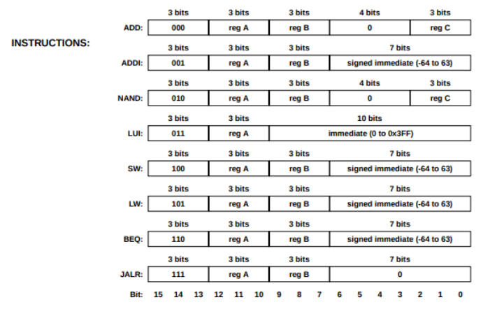

# RiSC16

RiSC stands for Ridiculously Simple Computer. It is an ISA used for teaching purposes, based on the Little Computer (LC-896) ISA developed by Peter Chen at the University of Michigan.

---

## ISA features

- 16-bit data and address bus
- 8 registers
- Based on RISC philosphy
- Similar to MIPS ISA

- Format of instructions :
    

- Function of instructions :
    

---

## Single stage implementation

- The block diagram for a single-stage implementation
  
- Implementation is in the [non_pipelined folder](./non_pipelined)

---

## Assembler

A very rudimentary assembler has also been implemented using python. Features to be added:

- Improved user experience
  - [ ] Error reporting
  - [ ] Hexadecimal and binary literals
  - [ ] Labels for jump and branch

- Improve codebase
  - [ ] Modular design using classes

---

## References
1) https://user.eng.umd.edu/~blj/RiSC/
 